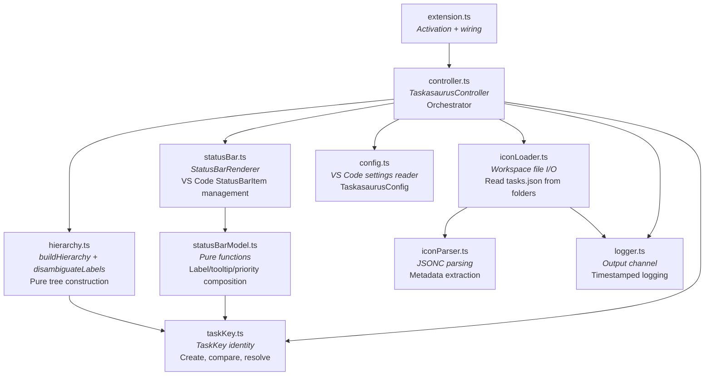
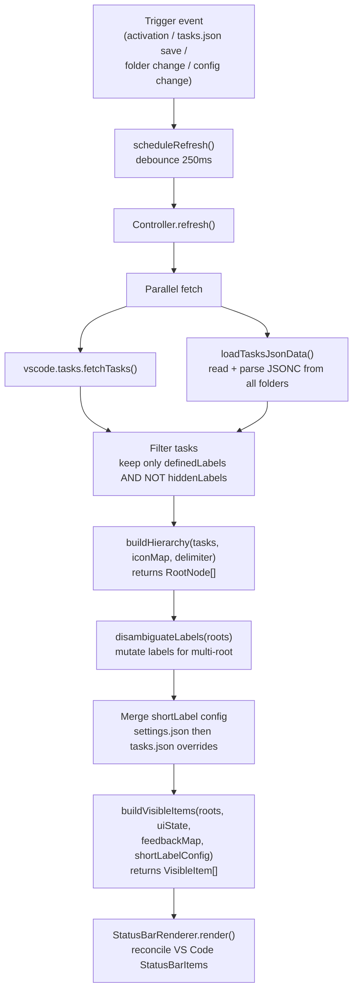

# Architecture

## Entry Point

Activation is defined in `src/extension.ts`. The `activate` function:

1. Creates a single `TaskasaurusController` instance.
2. Registers three commands: `taskasaurus.clickNode`, `taskasaurus.refresh`, `taskasaurus.collapse`.
3. Subscribes to three event sources: workspace folder changes, `tasks.json` saves, and configuration changes.
4. Triggers the initial `controller.refresh()`.
5. Registers a disposal hook that tears down the controller on deactivation.

**Activation events** (from `package.json`): `onStartupFinished`, `workspaceContains:.vscode/tasks.json`.

## Component Diagram



### Component Responsibilities

| Component           | Responsibility                                                                                                                                                | Purity                                            |
| ------------------- | ------------------------------------------------------------------------------------------------------------------------------------------------------------- | ------------------------------------------------- |
| `extension.ts`      | Lifecycle: create controller, register commands and event listeners, wire disposal.                                                                           | Side-effectful (VS Code API)                      |
| `controller.ts`     | Orchestrate refresh cycles, manage UIState and FeedbackMap, handle click routing, debounce, and auto-collapse timers.                                         | Side-effectful (timers, VS Code task API)         |
| `hierarchy.ts`      | Transform a flat list of VS Code tasks into a 2-level `RootNode[]` tree. Disambiguate labels for multi-root workspaces.                                       | Pure (no VS Code API calls)                       |
| `statusBar.ts`      | Own the pool of `vscode.StatusBarItem` instances. Reconcile (create/update/dispose) items to match `VisibleItem[]` output.                                    | Side-effectful (VS Code API)                      |
| `statusBarModel.ts` | Compute `VisibleItem[]` from `RootNode[]`, `UIState`, `FeedbackMap`, and `ShortLabelConfig`. Compose label text, tooltips, and priority numbers.              | Pure                                              |
| `taskKey.ts`        | Create `TaskKey` from a `vscode.Task`, serialize to string ID, compare for equality, resolve back to a task instance.                                         | Pure (except `resolveTask` searches a task array) |
| `iconParser.ts`     | Parse JSONC text via `jsonc-parser`. Extract `TaskDefinition[]`, icon mappings, hidden labels, defined labels, and group overrides.                           | Pure                                              |
| `iconLoader.ts`     | Read `.vscode/tasks.json` from each workspace folder via `vscode.workspace.fs`. Delegate parsing to `iconParser`. Aggregate results via `buildTasksMetadata`. | Side-effectful (file I/O)                         |
| `config.ts`         | Read `taskasaurus.*` settings from `vscode.workspace.getConfiguration`. Validate delimiter. Detect config change events.                                      | Side-effectful (VS Code API)                      |
| `logger.ts`         | Manage a VS Code `OutputChannel` named "Taskasaurus". Provide timestamped `logInfo`, `logDebug`, `logWarn` functions.                                         | Side-effectful (VS Code API)                      |

## Data Flow



### Step-by-step

1. **Trigger**: An event fires (activation, file save, folder change, or config change).
2. **Debounce**: `scheduleRefresh()` resets a 250ms timer. Multiple rapid events coalesce into a single refresh.
3. **Parallel fetch**: `vscode.tasks.fetchTasks()` and `loadTasksJsonData()` run concurrently via `Promise.all`.
4. **Filter**: The fetched task list is reduced to only those whose labels appear in `definedLabels` and not in `hiddenLabels`.
5. **Build hierarchy**: `buildHierarchy` groups filtered tasks into `RootLeafNode` and `ParentNode` (with `ChildLeafNode` children) based on delimiter splitting and the 2-child threshold.
6. **Disambiguate**: `disambiguateLabels` walks the tree and appends `【folderName】` suffixes where labels collide across workspace folders.
7. **Merge config**: Short-label overrides from `settings.json` and `tasks.json` are merged (tasks.json wins).
8. **Build visible items**: `buildVisibleItems` flattens the tree into an ordered `VisibleItem[]` based on current `UIState` (which group is expanded) and `FeedbackMap` (running/success/error icons).
9. **Render**: `StatusBarRenderer.render()` reconciles the VS Code `StatusBarItem` pool -- reusing items by `nodeId`, recreating when priority changes, and disposing items that are no longer visible.

## State Model

### UIState (in-memory, managed by controller)

```
UIState
  expandedGroupId?: NodeId    -- which group is currently expanded (undefined = all collapsed)
  lastInteractionAt?: number  -- Date.now() timestamp of last click
  collapseTimer?: Timeout     -- handle for the auto-collapse setTimeout
```

State transitions:

- **Parent click (different group)**: set `expandedGroupId` to new ID, restart collapse timer.
- **Parent click (same group)**: set `expandedGroupId` to `undefined`, clear collapse timer.
- **Leaf click**: set `expandedGroupId` to `undefined`, clear collapse timer, execute task.
- **Timeout fires**: set `expandedGroupId` to `undefined`, clear timer.

### FeedbackMap (in-memory, managed by controller)

```
FeedbackMap: Map<taskKeyId, TaskFeedback>
  TaskFeedback
    state: "running" | "success" | "error"
    timer?: Timeout    -- auto-clear timer (2s for success/error)
```

State transitions per task:

- **onDidStartTaskProcess**: set `{ state: "running" }`, clear any prior timer.
- **onDidEndTaskProcess (exit 0)**: set `{ state: "success", timer: 2s }`.
- **onDidEndTaskProcess (exit != 0)**: set `{ state: "error", timer: 2s }`.
- **Timer fires**: delete entry from map.

Each transition triggers a `render()` call to update the status bar.

## Cross-cutting Concerns

### Debounce

All refresh triggers route through `scheduleRefresh()`, which debounces at 250ms. This prevents render storms during rapid file saves or folder changes.

**Source:** `src/controller.ts` lines 143-151.

### Auto-collapse

When a group is expanded, the controller starts a timer (default 10 seconds, configurable via `taskasaurus.autoCollapseTimeout`). Every Taskasaurus click resets the timer. Setting the timeout to 0 disables the feature. The timer is cleared whenever the UI collapses.

**Source:** `src/controller.ts` lines 256-268.

### JSONC Parsing

All `tasks.json` files are parsed using the `jsonc-parser` library, which handles JSON with comments and trailing commas -- the format VS Code uses for its configuration files.

**Source:** `src/iconParser.ts` line 1 -- `import * as jsonc from "jsonc-parser"`.

### Priority Bands

Status bar item ordering uses a priority scheme that reserves gaps for child insertion:

- Root item at sorted index `i`: `10000 - i * 100`
- Child `j` under that root: `(10000 - i * 100) - 50 - j`

The 100-unit gap between roots and the 50-unit offset for children ensures children slot directly below their parent without overlapping adjacent roots. VS Code renders higher-priority items further to the left.

**Source:** `src/statusBarModel.ts` lines 42-48.

### StatusBarItem Reconciliation

The renderer maintains a `Map<NodeId, StatusBarItem>` for reuse across renders. On each render cycle:

1. Existing items matching a `nodeId` are reused if their priority has not changed.
2. Items with changed priority are disposed and recreated (priority is read-only after creation).
3. Items not present in the new `VisibleItem[]` list are disposed.

This minimizes flicker by avoiding unnecessary destruction and recreation.

**Source:** `src/statusBar.ts` lines 17-50.

### Error Handling

- **Task execution failure**: `executeTask` rejections are caught and surfaced via `vscode.window.showErrorMessage`.
- **Task not found**: If `resolveTask` returns `undefined`, an error message is shown.
- **File I/O failure**: `readTasksJsonFromFolder` catches all errors silently (file may not exist), returning empty results.
- **JSONC parse failure**: `parseTasksJsonFull` catches parse errors and returns empty task lists.

### Logging

All significant operations are logged to the "Taskasaurus" output channel with ISO timestamps. Log levels: INFO for lifecycle events and summaries, DEBUG for per-task filtering decisions. The channel is created lazily on first use and disposed on deactivation.

**Source:** `src/logger.ts`.

## Command Surface

| Command ID              | Trigger             | Behavior                                                                      |
| ----------------------- | ------------------- | ----------------------------------------------------------------------------- |
| `taskasaurus.clickNode` | StatusBarItem click | Routes to `onClickNode(nodeId)` -- expands/collapses groups or executes tasks |
| `taskasaurus.refresh`   | Manual invocation   | Forces a full refresh cycle (fetch + build + render)                          |
| `taskasaurus.collapse`  | Manual invocation   | Collapses any expanded group immediately                                      |

## Event Listeners

| Event                                                              | Handler                                            |
| ------------------------------------------------------------------ | -------------------------------------------------- |
| `workspace.onDidChangeWorkspaceFolders`                            | `scheduleRefresh()`                                |
| `workspace.onDidSaveTextDocument` (filtered to `tasks.json`)       | `scheduleRefresh()`                                |
| `workspace.onDidChangeConfiguration` (filtered to `taskasaurus.*`) | `scheduleRefresh()`                                |
| `tasks.onDidStartTaskProcess`                                      | `handleTaskStart()` -- update FeedbackMap          |
| `tasks.onDidEndTaskProcess`                                        | `handleTaskEnd()` -- update FeedbackMap with timer |
