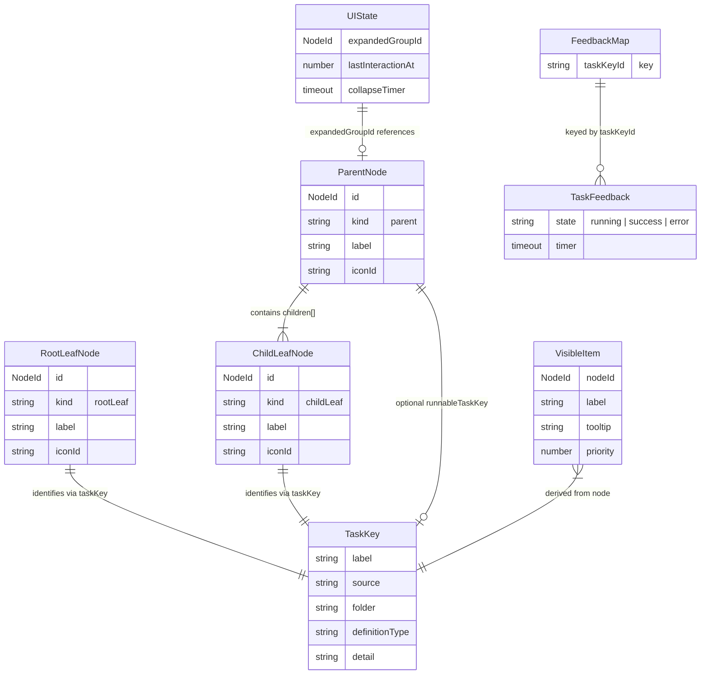

# Domain Model

## Glossary

| Term                  | Definition                                                                                                                                                              |
| --------------------- | ----------------------------------------------------------------------------------------------------------------------------------------------------------------------- |
| **Task**              | A VS Code workspace task defined in `.vscode/tasks.json`. Auto-detected tasks from providers (npm, TypeScript, etc.) are excluded.                                      |
| **TaskKey**           | The identity tuple `(label, source, folder?, definitionType?, detail?)` that uniquely identifies a task across workspace folders.                                       |
| **Node**              | A renderable unit in the status bar. Every visible element -- root leaf, parent group, or child leaf -- is a Node.                                                      |
| **RootLeafNode**      | A top-level task with no group. Clicking it executes the task.                                                                                                          |
| **ParentNode**        | A virtual group header created when 2+ tasks share a group prefix. Clicking it toggles expand/collapse. Not directly runnable unless `runnableTaskKey` is set.          |
| **ChildLeafNode**     | A task nested under a ParentNode, visible only when the parent is expanded. Clicking it executes the task.                                                              |
| **RootNode**          | Union of `RootLeafNode \| ParentNode` -- anything that appears at the top level.                                                                                        |
| **NodeId**            | A deterministic string identifier for a node, derived from its kind and TaskKey (or group name for parents). Format: `kind::label::source[::folder][::definitionType]`. |
| **Group**             | A virtual container derived from a shared label prefix. Groups have no corresponding VS Code task unless a task label exactly matches the group name.                   |
| **Delimiter**         | The character used to split task labels into group/name pairs. Default: `/`. Configurable via `taskasaurus.groupDelimiter`.                                             |
| **IconMap**           | `Map<string, string>` mapping task labels to codicon IDs, extracted from `tasks.json` icon definitions.                                                                 |
| **UIState**           | In-memory state tracking which group is expanded, the timestamp of the last interaction, and the auto-collapse timer handle.                                            |
| **TaskFeedback**      | Per-task execution state: `running`, `success`, or `error`. Each entry holds an optional timer for auto-clearing after 2 seconds.                                       |
| **FeedbackMap**       | `Map<string, TaskFeedback>` keyed by `taskKeyToId(taskKey)`. Tracks all active feedback indicators.                                                                     |
| **VisibleItem**       | A computed rendering instruction for a single StatusBarItem: label text, tooltip, priority number, and command arguments.                                               |
| **ShortLabelConfig**  | Configuration controlling whether child labels strip the group prefix. Composed from global default, delimiter, and per-group overrides.                                |
| **TasksJsonMetadata** | Aggregated metadata from all workspace folder `tasks.json` files: icon map, hidden labels, defined labels, and group overrides.                                         |
| **Accordion**         | The interaction model where at most one group is expanded at any time. Expanding a group collapses any previously expanded group.                                       |
| **Auto-collapse**     | A timer-based behavior that collapses the expanded group after a configurable timeout (default 10 seconds) of inactivity.                                               |

## Entity Relationships

## Invariants

These invariants hold at all times after a refresh cycle completes.

### INV-1: Group formation threshold

A `ParentNode` is created only when 2 or more tasks share the same group prefix (the substring before the first delimiter). If only one task has a given prefix, it remains a `RootLeafNode`.

**Source:** `src/hierarchy.ts` lines 76-81 -- `validGroups` set is populated only when `count >= 2`.

### INV-2: Single expanded group (accordion)

`UIState.expandedGroupId` contains at most one `NodeId` at any time. Expanding a group unconditionally replaces any previously expanded group.

**Source:** `src/controller.ts` lines 201-212 -- `handleParentClick` sets `expandedGroupId` to the new ID or `undefined`, never accumulates multiple.

### INV-3: Auto-collapse timeout

When a group is expanded, a collapse timer starts. If no Taskasaurus click occurs within the timeout period (default 10 seconds, configurable), the group collapses automatically. The timer resets on every click. Setting the timeout to 0 disables auto-collapse.

**Source:** `src/controller.ts` lines 256-268 -- `startCollapseTimer` reads `taskasaurus.autoCollapseTimeout` and schedules `collapse()`.

### INV-4: Hidden tasks excluded before grouping

Tasks marked with `"hide": true` in `tasks.json` are removed from the task list before the grouping algorithm runs. Hidden tasks do not contribute to group counts, do not appear as nodes, and do not receive feedback indicators.

**Source:** `src/controller.ts` lines 96-114 -- filtering loop checks `isHidden` before adding to `visibleTasks`.

### INV-5: Only tasks.json-defined tasks appear

A task appears in the status bar only if its label exists in the `definedLabels` set extracted from `tasks.json`. Auto-detected tasks from providers are excluded even if `vscode.tasks.fetchTasks()` returns them.

**Source:** `src/controller.ts` line 100 -- `isDefinedInTasksJson = tasksJsonData.definedLabels.has(task.name)`.

### INV-6: Feedback state exclusivity

A task's feedback entry in `FeedbackMap` holds exactly one state at a time (`running`, `success`, or `error`). Transitioning to a new state clears any existing timer from the previous state.

**Source:** `src/controller.ts` lines 48-83 -- `handleTaskStart` and `handleTaskEnd` both clear existing timers before updating.

### INV-7: Node ID determinism

A node's ID is deterministic given its kind and identity. `RootLeafNode` and `ChildLeafNode` IDs derive from `kind::taskKeyToId(taskKey)`. `ParentNode` IDs derive from `parent::groupName`. This ensures stable reconciliation across re-renders.

**Source:** `src/hierarchy.ts` lines 44-49 -- `generateNodeId` function.

## Business Rules

### BR-1: Label splitting (group derivation)

The first occurrence of the delimiter in a task label splits the label into `GroupName` (before) and task-specific name (after). Only the first delimiter matters; subsequent delimiters are part of the task name.

- Input: `"Test/unit"` with delimiter `/` yields group `"Test"`.
- Input: `"Build"` with delimiter `/` yields no group (root leaf).
- Input: `"Check/style/format"` with delimiter `/` yields group `"Check"`.

**Source:** `src/hierarchy.ts` lines 22-28 -- `parseGroupName` uses `indexOf(delimiter)` and `substring(0, delimiterIndex)`.

### BR-2: Exact-match runnable group task

When a task label equals a group name exactly (e.g., a task named `"Test"` coexists with `"Test/unit"` and `"Test/e2e"`):

1. The `ParentNode` remains a non-runnable toggle.
2. The exact-match task becomes a `ChildLeafNode` placed at the top of the children list.
3. The `ParentNode.runnableTaskKey` is set so the parent can display the task's icon and relay feedback.

**Source:** `src/hierarchy.ts` lines 83-89 (detection), lines 123-125 (assignment), lines 159-169 (sort to top).

### BR-3: Multi-root label disambiguation

When multiple tasks across different workspace folders share the same label, a `【folderName】` suffix is appended to the display label. Tasks within the same folder sharing a label are not disambiguated (this is a cross-folder concern only).

- `Build` in folder `api` and `Build` in folder `web` become `Build【api】` and `Build【web】`.
- Child labels are also disambiguated independently.
- The suffix uses fullwidth brackets to avoid collision with common label characters.

**Source:** `src/hierarchy.ts` lines 196-239 -- `disambiguateLabels` mutates node labels in place.

### BR-4: Short child labels

When a group is expanded, child labels can strip the redundant `GroupName + delimiter` prefix. This is controlled by a three-tier configuration:

1. **Per-group override in `tasks.json`** (highest priority): `taskasaurus.groups.<GroupName>.shortLabel`
2. **Per-group override in `settings.json`**: `taskasaurus.groups.<GroupName>.shortLabel`
3. **Global default in `settings.json`**: `taskasaurus.shortChildLabels`
4. **Built-in default**: `true`

If the child label does not start with the expected prefix (e.g., the exact-match runnable task), it is shown as-is.

**Source:** `src/statusBarModel.ts` lines 84-100 -- `computeDisplayLabel` checks `groupOverrides` then `globalDefault`.

### BR-5: Config resolution order for group overrides

When merging `shortLabel` overrides, settings.json overrides are loaded first, then `tasks.json` overrides overwrite them. This gives `tasks.json` (repo-local, version-controlled) the highest priority.

**Source:** `src/controller.ts` lines 122-138 -- settings overrides are written first, then `tasksJsonData.groupOverrides` overwrites.

### BR-6: Sorting

- **Root nodes**: Alphabetical by display label (case-insensitive). Ties broken by case-sensitive comparison.
- **Children within a group**: Alphabetical by full task label (case-insensitive), with the exact-match runnable task (if any) promoted to the top.
- Sorting uses the full label, not the short display label.

**Source:** `src/hierarchy.ts` lines 153-156 (children), lines 186-191 (roots).

### BR-7: Priority bands

Status bar ordering uses numeric priority to position items left-to-right:

- Root item at index `i`: priority = `10000 - i * 100`
- Child `j` under root `i`: priority = `(10000 - i * 100) - 50 - j`

This guarantees children appear immediately after their parent with no interleaving.

**Source:** `src/statusBarModel.ts` lines 42-48 -- `computePriority` function.

### BR-8: Feedback display lifecycle

1. On `onDidStartTaskProcess`: set state to `running`, clear any prior timer.
2. On `onDidEndTaskProcess`: set state to `success` (exit code 0) or `error` (non-zero), start a 2-second timer to clear the entry.
3. The feedback icon (`$(loading~spin)`, `$(check)`, `$(error)`) takes precedence over the task's configured icon.

**Source:** `src/controller.ts` lines 48-83, `src/statusBarModel.ts` lines 22-32.

### BR-9: Leaf click collapses then executes

Clicking any leaf node (root or child) immediately collapses all groups and re-renders before starting task execution. This ensures the status bar returns to its compact state regardless of whether the task launch succeeds.

**Source:** `src/controller.ts` lines 214-233 -- `handleLeafClick` sets `expandedGroupId` to `undefined` and calls `render()` before `executeTask`.
