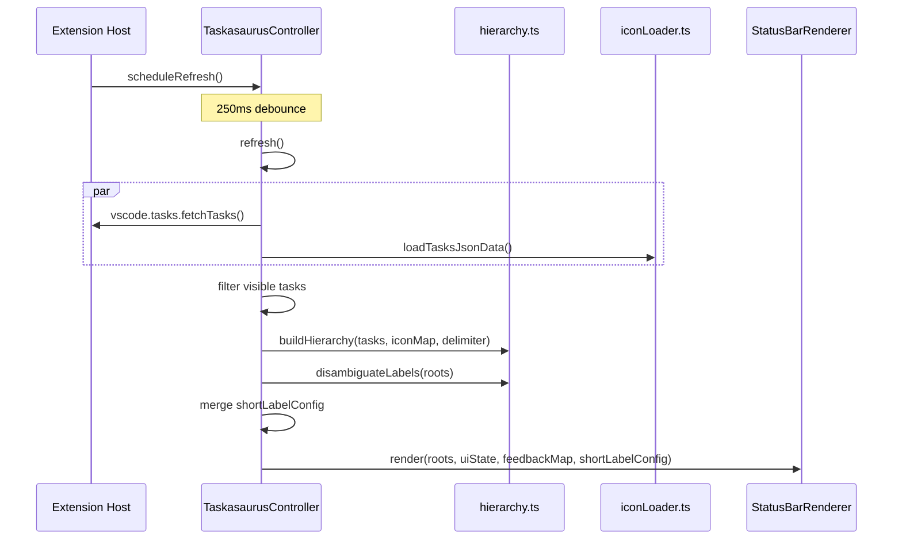

# TaskasaurusController

Central orchestrator that owns UI state, task feedback, and coordinates refresh/render cycles.

**File:** `src/controller.ts`

## Public Surface

| Export                  | Type       | Description                                                  |
| ----------------------- | ---------- | ------------------------------------------------------------ |
| `TaskasaurusController` | class      | Main controller; created once at activation                  |
| `FeedbackMap`           | type alias | `Map<string, TaskFeedback>` keyed by `taskKeyToId()` strings |

## Responsibilities

- Owns `UIState` (tracks `expandedGroupId`, `collapseTimer`, `lastInteractionAt`) and `FeedbackMap`.
- `refresh()`: fetches tasks via `vscode.tasks.fetchTasks()` and tasks.json data via `loadTasksJsonData()` (`src/iconLoader.ts`) in parallel; filters to visible tasks; builds hierarchy via `buildHierarchy()` (`src/hierarchy.ts`); calls `disambiguateLabels()` (`src/hierarchy.ts`); merges short-label config; renders.
- `scheduleRefresh()`: debounced wrapper around `refresh()` using `REFRESH_DEBOUNCE_MS`.
- `onClickNode(nodeId)`: dispatches to `handleParentClick()` or `handleLeafClick()` based on `node.kind`.
- `handleParentClick()`: accordion toggle -- expands clicked group and collapses any other, or collapses if already expanded. Starts collapse timer on expand, clears on collapse.
- `handleLeafClick(taskKey)`: collapses all groups, resolves the task via `resolveTask()` (`src/taskKey.ts`), calls `vscode.tasks.executeTask()`. Catches execution failures with `vscode.window.showErrorMessage()`.
- Task feedback: listens to `vscode.tasks.onDidStartTaskProcess` and `vscode.tasks.onDidEndTaskProcess` via `setupTaskListeners()`. Updates `FeedbackMap` entries and triggers re-render.
- Auto-collapse timer: reads `taskasaurus.autoCollapseTimeout` setting directly from `vscode.workspace.getConfiguration()`. Value of `0` disables auto-collapse.
- Short-label config: merges `settings.json` group overrides first, then `tasks.json` group overrides on top (tasks.json wins). Stored as `ShortLabelConfig` (`src/statusBarModel.ts`).

### Non-Goals

- Does not own status bar item creation (delegated to `StatusBarRenderer` in `src/statusBar.ts`).
- Does not parse tasks.json (delegated to `src/iconParser.ts` and `src/iconLoader.ts`).
- Does not compute visible item labels or priorities (delegated to `src/statusBarModel.ts`).

## How It Works

## Key Types

| Type | Location | Description |
| --- | --- | --- |
| `FeedbackMap` | `src/controller.ts` | `Map<string, TaskFeedback>` |
| `UIState` | `src/types.ts` | `{ expandedGroupId?, lastInteractionAt?, collapseTimer? }` |
| `TaskFeedback` | `src/types.ts` | `{ state: "running" \| "success" \| "error", timer? }` |
| `ShortLabelConfig` | `src/statusBarModel.ts` | `{ globalDefault, delimiter, groupOverrides }` |

## Constants

| Name                       | Value    | Defined in          |
| -------------------------- | -------- | ------------------- |
| `AUTO_COLLAPSE_TIMEOUT_MS` | `10_000` | `src/controller.ts` |
| `REFRESH_DEBOUNCE_MS`      | `250`    | `src/controller.ts` |
| `FEEDBACK_DISPLAY_MS`      | `2_000`  | `src/controller.ts` |

## Invariants and Failure Modes

- At most one group is expanded at any time (`uiState.expandedGroupId` is a single `NodeId | undefined`).
- `onClickNode()` silently warns and returns if `nodeId` is not found in the current `roots` tree (guards against stale command args after a refresh).
- `handleLeafClick()` shows an error message if `resolveTask()` returns `undefined` or `executeTask()` rejects.
- All timers (collapse timer, refresh timer, feedback timers) are cleaned up in `dispose()`.
- Feedback display duration is fixed at `FEEDBACK_DISPLAY_MS` (2 seconds) after task end, regardless of success or error.

## Extension Points

- Auto-collapse timeout is configurable via `taskasaurus.autoCollapseTimeout` setting (read in `startCollapseTimer()`).
- Group delimiter and short-label behavior are configurable via `getConfig()` (`src/config.ts`).

## Related Files

- `src/types.ts` -- `UIState`, `TaskFeedback`, `RootNode`, `Node`, `TaskKey`
- `src/hierarchy.ts` -- `buildHierarchy()`, `disambiguateLabels()`
- `src/taskKey.ts` -- `createTaskKey()`, `resolveTask()`, `taskKeyToId()`
- `src/statusBar.ts` -- `StatusBarRenderer`
- `src/statusBarModel.ts` -- `ShortLabelConfig`
- `src/iconLoader.ts` -- `loadTasksJsonData()`
- `src/config.ts` -- `getConfig()`
- `src/logger.ts` -- `logInfo()`, `logTaskSource()`, `logFilteringSummary()`
