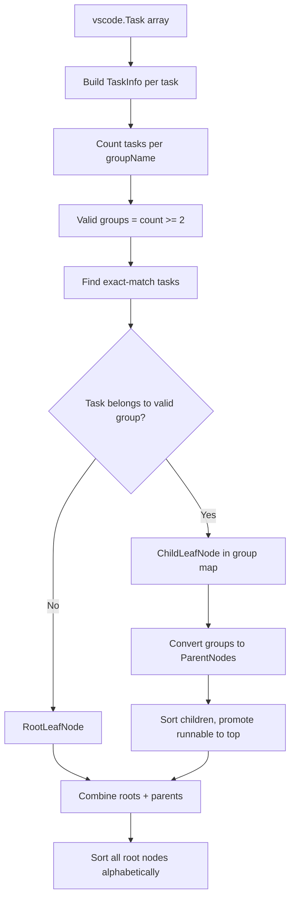

# Hierarchy Builder

Transforms a flat list of VS Code tasks into a two-level tree of root nodes (parents and leaves) used for status bar rendering.

**File:** `src/hierarchy.ts`

## Public Surface

| Export                                       | Type               | File               |
| -------------------------------------------- | ------------------ | ------------------ |
| `buildHierarchy(tasks, iconMap, delimiter?)` | function           | `src/hierarchy.ts` |
| `disambiguateLabels(nodes)`                  | function (mutates) | `src/hierarchy.ts` |

## Responsibilities

- Groups tasks by a configurable delimiter (default `"/"`) into parent/child relationships.
- Produces `RootLeafNode`, `ParentNode`, and `ChildLeafNode` nodes with stable IDs.
- Handles the edge case where a task label exactly equals a group name (promotes it as a runnable child at the top of the group).
- `disambiguateLabels()` appends `【folderName】` suffixes to nodes that share the same label across different workspace folders.

### Non-Goals

- Does not filter tasks (filtering happens in `TaskasaurusController.refresh()` in `src/controller.ts`).
- Does not determine display labels for short-label mode (handled by `computeDisplayLabel()` in `src/statusBarModel.ts`).
- Does not interact with VS Code APIs directly (accepts plain `vscode.Task[]`).

## How It Works

### `buildHierarchy()` Algorithm

1. Build a `TaskInfo` record for each task: extracts `taskKey` via `createTaskKey()` (`src/taskKey.ts`), `label` from `task.name`, `groupName` via `parseGroupName()`, `iconId` via `getTaskIconId()`, and `originalIndex`.
2. Count tasks per `groupName` using a frequency map.
3. Determine valid groups: groups with 2 or more children (tasks containing the delimiter whose prefix matches).
4. Identify exact-match tasks: tasks with no delimiter whose `label` matches a valid group name. These are added to the group as runnable children.
5. For each task: if it belongs to a valid group, create a `ChildLeafNode` and add to the group map. If its label equals the group name exactly, record it as `runnableTask`. Otherwise, create a `RootLeafNode`.
6. Convert group map entries to `ParentNode` instances. Sort children alphabetically (case-insensitive, with case-sensitive tiebreak). Move the runnable task child to index 0 if present.
7. Combine all `RootLeafNode` and `ParentNode` into a single array. Sort alphabetically by label (case-insensitive).

### `disambiguateLabels()` Algorithm

1. Collect all node labels (roots and their children) into a `Map<string, RootNode[]>`.
2. For each label with 2+ nodes from different folders (determined by `taskKey.folder`), append `【folderName】` to the label string in-place.

## Key Types

| Type            | Location                      | Description                                                          |
| --------------- | ----------------------------- | -------------------------------------------------------------------- |
| `TaskInfo`      | `src/hierarchy.ts` (internal) | `{ task, taskKey, label, groupName, iconId, originalIndex }`         |
| `RootNode`      | `src/types.ts`                | `RootLeafNode \| ParentNode`                                         |
| `ParentNode`    | `src/types.ts`                | `{ id, kind: "parent", label, iconId?, children, runnableTaskKey? }` |
| `ChildLeafNode` | `src/types.ts`                | `{ id, kind: "childLeaf", label, taskKey, iconId? }`                 |
| `RootLeafNode`  | `src/types.ts`                | `{ id, kind: "rootLeaf", label, taskKey, iconId? }`                  |
| `IconMap`       | `src/types.ts`                | `Map<string, string>` -- task label to codicon ID                    |

## Invariants and Failure Modes

- A group is only created when 2 or more slashed tasks share the same prefix. A single-child group is promoted to a `RootLeafNode`.
- Node IDs are deterministic: `generateNodeId()` uses the node kind and either the `taskKeyToId()` string or the group name.
- `disambiguateLabels()` mutates node labels in place. It only appends folder suffixes when the same label appears in 2+ distinct folders.
- `getTaskIconId()` checks runtime `task.icon.id` first, then falls back to `iconMap` from tasks.json. If neither exists, `iconId` is `undefined`.

## Extension Points

- The `delimiter` parameter (default `"/"`) is configurable via `taskasaurus.groupDelimiter` setting, passed through from `getConfig()` (`src/config.ts`).

## Related Files

- `src/types.ts` -- all node types, `IconMap`, `TaskKey`
- `src/taskKey.ts` -- `createTaskKey()`, `taskKeyToId()`
- `src/controller.ts` -- calls `buildHierarchy()` and `disambiguateLabels()` during `refresh()`
