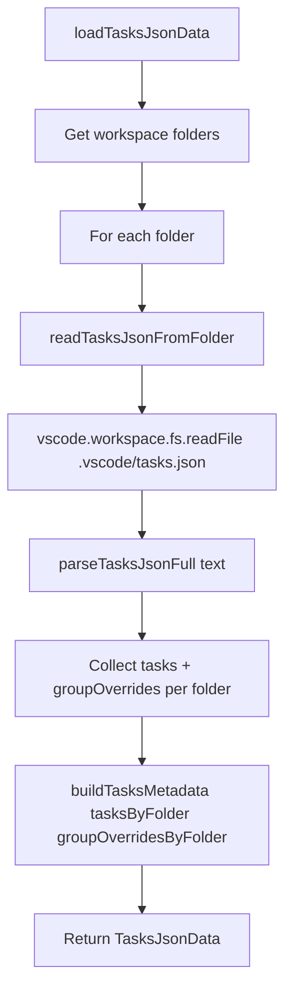

# Workspace File I/O

Reads `.vscode/tasks.json` from all workspace folders and produces merged task metadata.

**File:** `src/iconLoader.ts`

## Public Surface

| Export | Type | File |
|---|---|---|
| `loadTasksJsonData()` | async function | `src/iconLoader.ts` |
| `TasksJsonData` | type alias | `src/iconLoader.ts` |

## Responsibilities

- `loadTasksJsonData()`: iterates all workspace folders from `vscode.workspace.workspaceFolders`, reads each folder's `.vscode/tasks.json` via `readTasksJsonFromFolder()`, collects task definitions and group overrides per folder, then delegates to `buildTasksMetadata()` (`src/iconParser.ts`) for merging.
- `TasksJsonData` is a re-exported alias for `TasksJsonMetadata` (`src/iconParser.ts`), containing `iconMap`, `hiddenLabels`, `definedLabels`, and `groupOverrides`.

### Non-Goals

- Does not parse JSONC directly (delegates to `parseTasksJsonFull()` in `src/iconParser.ts`).
- Does not filter or process tasks beyond extracting metadata.

## How It Works

## Key Types

| Type | Location | Description |
|---|---|---|
| `TasksJsonData` | `src/iconLoader.ts` | Alias for `TasksJsonMetadata` |
| `TasksJsonMetadata` | `src/iconParser.ts` | `{ iconMap, hiddenLabels, definedLabels, groupOverrides }` |
| `FolderTasksJsonData` | `src/iconLoader.ts` (internal) | `{ tasks: TaskDefinition[], groupOverrides: TasksJsonGroupOverrides }` |

## Invariants and Failure Modes

- `readTasksJsonFromFolder()` catches all exceptions from `vscode.workspace.fs.readFile()`. Missing or unreadable files result in empty task definitions and empty group overrides for that folder.
- Logs discovery via `logTasksJsonFound()` (`src/logger.ts`) on success and `logTasksJsonNotFound()` on failure.
- File content is decoded as UTF-8 via `TextDecoder`.
- Folders are processed sequentially (not in parallel).
- If `vscode.workspace.workspaceFolders` is `undefined` (no workspace open), returns empty metadata.

## Extension Points

None. This module reads from a fixed path (`.vscode/tasks.json`) per workspace folder.

## Related Files

- `src/iconParser.ts` -- `parseTasksJsonFull()`, `buildTasksMetadata()`, `TasksJsonMetadata`, `TaskDefinition`
- `src/logger.ts` -- `logTasksJsonFound()`, `logTasksJsonNotFound()`
- `src/controller.ts` -- calls `loadTasksJsonData()` during `refresh()`
