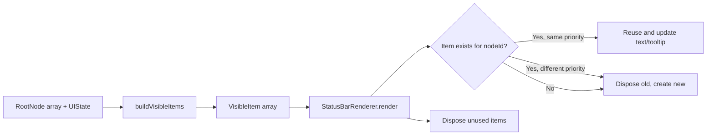

# Status Bar Rendering

Manages the pool of VS Code status bar items and computes their labels, tooltips, and priorities from the node tree.

**Files:** `src/statusBar.ts` (renderer), `src/statusBarModel.ts` (pure model functions)

## Public Surface

| Export                                                               | Type         | File                    |
| -------------------------------------------------------------------- | ------------ | ----------------------- |
| `StatusBarRenderer`                                                  | class        | `src/statusBar.ts`      |
| `buildVisibleItems(roots, uiState, feedbackMap?, shortLabelConfig?)` | function     | `src/statusBarModel.ts` |
| `computePriority(rootIndex, childIndex?)`                            | function     | `src/statusBarModel.ts` |
| `composeParentLabel(node, expanded, feedback?)`                      | function     | `src/statusBarModel.ts` |
| `composeRootLeafLabel(node, feedback?)`                              | function     | `src/statusBarModel.ts` |
| `composeChildLeafLabel(node, feedback?, displayLabel?)`              | function     | `src/statusBarModel.ts` |
| `computeDisplayLabel(childLabel, parentLabel, config?)`              | function     | `src/statusBarModel.ts` |
| `COMMAND_ID`                                                         | const string | `src/statusBarModel.ts` |
| `VisibleItem`                                                        | type         | `src/statusBarModel.ts` |
| `ShortLabelConfig`                                                   | type         | `src/statusBarModel.ts` |
| `FeedbackMap`                                                        | type alias   | `src/statusBarModel.ts` |

## Responsibilities

### StatusBarRenderer (`src/statusBar.ts`)

- Maintains a pool of `vscode.StatusBarItem` instances and a `Map<NodeId, StatusBarItem>` for reconciliation.
- `render()`: calls `buildVisibleItems()` to get the desired state, then reconciles:
  - Reuses existing items by `nodeId` when priority has not changed.
  - Recreates items when priority changes (priority is read-only after `createStatusBarItem()`).
  - Disposes items no longer present in the visible set.
- `dispose()`: disposes all status bar items and clears internal maps.

### StatusBarModel (`src/statusBarModel.ts`)

Pure functions with no VS Code runtime dependency (testable without the extension host):

- `buildVisibleItems()`: iterates root nodes, emits a `VisibleItem` per visible node. When a parent is expanded (`uiState.expandedGroupId === node.id`), emits child items immediately after it.
- `computePriority()`: assigns priority bands so items sort correctly in the status bar. Root item `i` gets priority `10000 - i*100`. Child `j` under root `i` gets `10000 - i*100 - 50 - j`.
- `composeParentLabel()`: formats `[feedbackIcon|taskIcon] Label $(chevron-right|chevron-down)`. Feedback icon takes precedence over task icon.
- `composeRootLeafLabel()`: formats `[feedbackIcon|taskIcon] Label`.
- `composeChildLeafLabel()`: formats `$(arrow-small-right) [feedbackIcon|taskIcon] Label`.
- `computeDisplayLabel()`: strips `parentLabel + delimiter` prefix from child label when short labels are enabled. Respects per-group overrides via `ShortLabelConfig.groupOverrides`, falling back to `ShortLabelConfig.globalDefault`.
- Tooltip functions (`composeParentTooltip`, `composeLeafTooltip`): internal. Parent tooltip uses "Expand/Collapse group 'X'". Leaf tooltip uses "Run task 'X'" unless a `detail` string is provided, in which case it uses the detail as-is.

### Non-Goals

- Does not own UI state or feedback tracking (owned by `TaskasaurusController` in `src/controller.ts`).
- Does not build the node hierarchy (handled by `src/hierarchy.ts`).

## How It Works

## Key Types

| Type               | Location                | Description                                                                           |
| ------------------ | ----------------------- | ------------------------------------------------------------------------------------- |
| `VisibleItem`      | `src/statusBarModel.ts` | `{ nodeId, label, tooltip, priority, commandArgs }`                                   |
| `ShortLabelConfig` | `src/statusBarModel.ts` | `{ globalDefault: boolean, delimiter: string, groupOverrides: Map<string, boolean> }` |
| `FeedbackMap`      | `src/statusBarModel.ts` | `Map<string, TaskFeedback>`                                                           |
| `COMMAND_ID`       | `src/statusBarModel.ts` | `"taskasaurus.clickNode"`                                                             |

## Invariants and Failure Modes

- Every `StatusBarItem` is assigned `vscode.StatusBarAlignment.Left` and a numeric priority.
- Items are disposed when no longer visible. The reconciliation loop guarantees no leaked items across renders.
- `getFeedbackIcon()` maps `"running"` to `$(loading~spin)`, `"success"` to `$(check)`, `"error"` to `$(error)`.
- Feedback icon always takes precedence over the task icon in label composition.
- `composeLeafTooltip()` returns the task `detail` string verbatim if present and non-empty; otherwise falls back to the default "Run task" format.

## Extension Points

- `ShortLabelConfig` is assembled in the controller from settings and tasks.json overrides, then passed through to `buildVisibleItems()`.
- `COMMAND_ID` is used by both the renderer (sets `item.command`) and the extension activation code (registers the command handler).

## Related Files

- `src/types.ts` -- `RootNode`, `ChildLeafNode`, `UIState`, `TaskFeedback`, `NodeId`
- `src/taskKey.ts` -- `taskKeyToId()` used by `getFeedbackForTaskKey()`
- `src/controller.ts` -- calls `StatusBarRenderer.render()` and owns `FeedbackMap`
